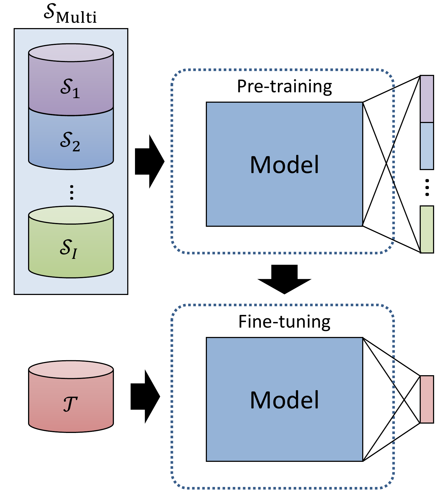

# Model Selection with a Shapelet-based Distance Measure for Multi-source Transfer Learning in Time Series Classification
This repository is to introduce our paper "Model Selection with a Shapelet-based Distance Measure for Multi-source Transfer Learning in Time Series Classification", accepted at ICPR 2024 (International Conference on Pattern Recognition 2024) and also available in [arXiv](https://arxiv.org/abs/2409.20005).

### Multi-source Transfer Learning
<p align="center">
  
</p>

### Docker
```
cd docker
docker build -t transferlearn .
```

### Dataset
This repository uses the UCR Time Series Archive 2018 datasets. To install the datasets, download the .zip file from [hear](https://www.cs.ucr.edu/~eamonn/time_series_data_2018/), and extract the contents into the "data/".

### Code
The codes are divided into three parts: Shapelet Discovery, Dataset Ranking with Shapelet-based Similarity, and Multi-source Transfer Learning.

#### Shapelet Discovery
We discover shapelets with matrix profile based approach (Yeh et al., 2016).

```
python generate_shapelet.py
```
The codes are modified from the following link
- https://stumpy.readthedocs.io/en/latest/Tutorial_Shapelet_Discovery.html

##### References
- Yeh, Chin-Chia Michael, et al. "Matrix profile I: all pairs similarity joins for time series: a unifying view that includes motifs, discords and shapelets." 2016 IEEE 16th international conference on data mining (ICDM). Ieee, 2016.

#### Calculate Shapelet-based Similariy
This is to calculate our novel method of Shapelet-based Similarity for transferability estimation.
```
python calculate_shapelet_distance.py
```

#### Multi-source Transfer Learning
This does multi-source tranfer learning with the rankings of shapelet-based similarity.
The following line conducts multi-source transfer learning with 10 sources selected by Minimum Shapelet for all the 128 UCR Archive datasets.
```
python main.py -dn 10 --target experiment --metric Minimum_Shapelet
```

### Citation
If you use this repository, please cite us as follows:
```
@article{lee2024model,
  title={Model Selection with a Shapelet-based Distance Measure for Multi-source Transfer Learning in Time Series Classification},
  author={Lee, Jiseok and Iwana, Brian Kenji},
  journal={arXiv preprint arXiv:2409.20005},
  year={2024}
}
```

### Contact
jiseok.lee@human.ait.kyushu-u.ac.jp